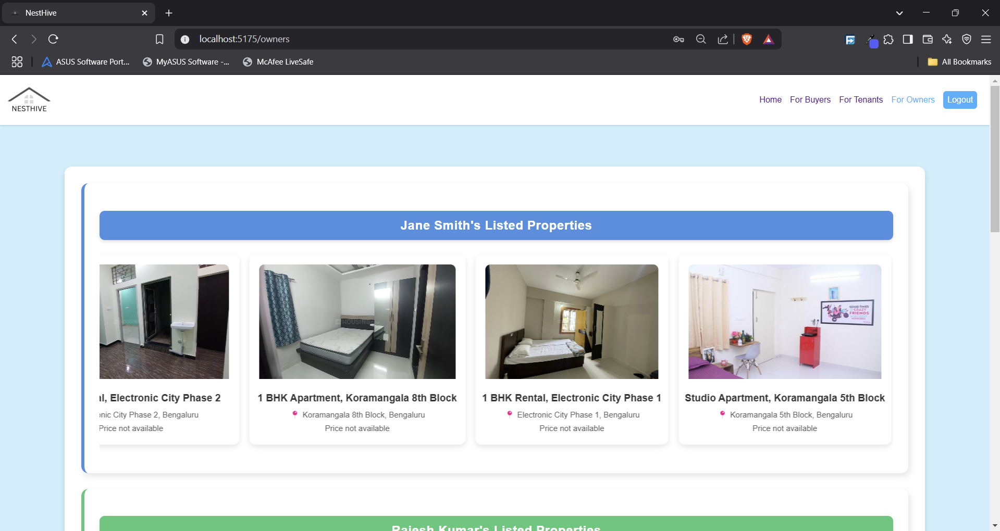

# Property Listing Platform
# B43_WEB_160_Web-Project-155
Individual Construct Week Project(React-Front-end)

## Project Overview

The **Property Listing Platform** is a fully frontend-focused web application designed to enhance the real estate browsing experience. It enables users to search, filter, and view property listings with rich interactive features and user-friendly options.

## Screenshots

### Login/Signup Page

### Homepage

### Property Details Page

### Buyers/Buyer-details Page

### Tenant/Tenant-details Page

### Owner/Owner-details Page

### Privacy & Policy Page

### Term of Service Page

### Footer Section

## Features

### 1. **Advanced, Real-Time Search Filters**
- Dynamic filtering system that updates property results in real-time.
- Multi-select dropdowns and range sliders for price, bedrooms, and square footage.
- Location-based search with interactive maps and radius selection.
- Responsive filter system optimized for mobile devices.

### 2. **Interactive Property Details Page**
- High-quality image carousel with zoom and video tour support.
- Interactive maps showing property location and nearby points of interest.
- Organized property information sections with clear visual hierarchy.
- Floor plans and virtual tours for an immersive experience.

### 3. **Responsive, Mobile-Optimized Design**
- Fully responsive across all devices (smartphones, tablets, desktops).
- Optimized touch interactions for sliders, carousels, and maps.
- Mobile-friendly navigation with collapsible menus.

### 4. **Sorting and Custom View Options**
- Sort properties by price, date added, and proximity.
- Multiple view modes: grid view, list view, and map view.

### Video Demo
[(https://drive.google.com/file/d/1li7VaC0f05w7QY4KCEz1DpB3NU8DJiBb/view?usp=sharing)]

## Live Demo
Check out the live demo:  
[Netlify Link](https://yourwebsite.com)

## Key Goals
- **Seamless Property Discovery**: Quick and efficient property browsing.
- **Detailed, Interactive Property Information**: Engaging property pages with comprehensive details.
- **Mobile-First Design**: Fully optimized for all screen sizes.

## Tech Stack
- **React**: For building an interactive user interface.
- **HTML & CSS**: For structuring and styling the web pages.
- **JavaScript**: For dynamic functionality and interactivity.

## Project Type
- **Individual Project**: This project is built independently to showcase frontend development skills.
